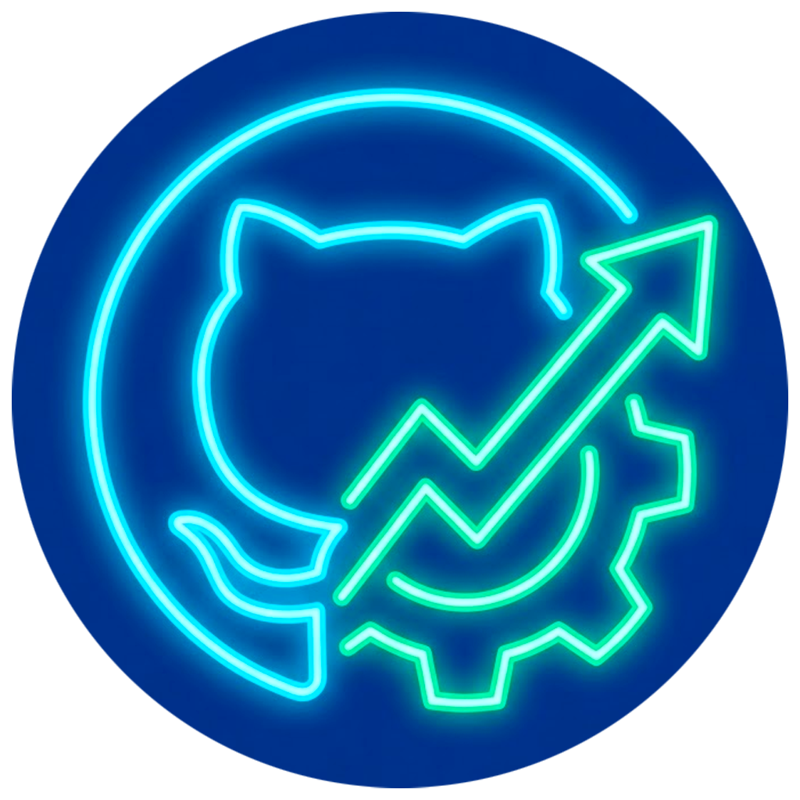
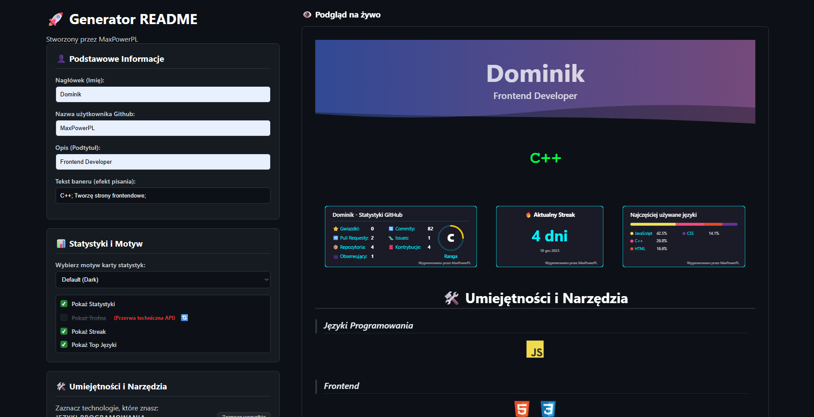
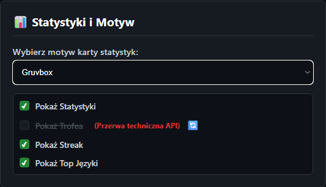
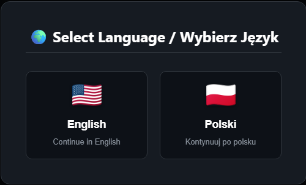

<div align="center">

  

  # 🚀 GitHub README Generator

  **Stwórz profesjonalny profil GitHub w kilka sekund dzięki własnemu, stabilnemu API.**
  <br>
  *Projekt stworzony za pomocą HTML5, CSS3, Vanilla JS, Vercel Serverless Functions i GitHub GraphQL API*

  <p>
    <a href="https://github.com/MaxPowerPL/github-readme-generator/releases/tag/">
      
    </a>
    <a href="https://github-readme-generator-xi.vercel.app">
      
    </a>
    <a href="https://html.spec.whatwg.org/">
      
    </a>
    <a href="https://vercel.com">
      
    </a>
    <a href="https://github.com/MaxPowerPL/github-readme-generator/stargazers">
      
    </a>
    <a href="https://github.com/MaxPowerPL/github-readme-generator/commits">
      
    </a>
    <a href="LICENSE">
      
    </a>
  </p>

  <p>
    <a href="#-o-projekcie">📖 O Projekcie</a> •
    <a href="#-funkcjonalności">✨ Funkcjonalności</a> •
    <a href="#-instalacja-i-uruchomienie">🚀 Instalacja</a> •
    <a href="#-struktura-projektu">📂 Struktura</a> •
    <a href="https://github-readme-generator-xi.vercel.app">🔴 Demo na żywo</a>
  </p>
</div>

---

## 📖 O Projekcie

**GitHub README Generator** to potężne narzędzie stworzone, aby pomóc programistom w szybkim generowaniu estetycznych i profesjonalnych profili GitHub.

W przeciwieństwie do wielu innych generatorów, które polegają na niestabilnych zewnętrznych API (często zwracających błędy `503 Service Unavailable`), ten projekt wprowadza **autorskie API Backendowe** hostowane na Vercel. Komunikuje się ono bezpośrednio z GraphQL API GitHuba, pobierając dane w czasie rzeczywistym, co gwarantuje, że Twoje statystyki są zawsze dokładne i dostępne.



### 🎯 Aktualna Wersja: `v1.1 (Latest)`
Aktualizacja wprowadzająca ulepszony algorytm obliczania passy (Streak). Od teraz karta statystyk wyświetla nie tylko aktualną, ale i **najdłuższą passę (Longest Streak)** w układzie dwukolumnowym.

---

## ✨ Funkcjonalności

Co już działa w tej wersji?

- [x] **⚡ Niezależne i Stabilne API**:
  - **Koniec z uszkodzonymi obrazkami:** Zasilane przez Vercel Serverless Functions.
  - **Integracja GraphQL:** Pobiera szczegółowe dane bezpośrednio z GitHuba.
  - **Inteligentne Cache'owanie:** Implementuje `Cache-Control` (1h) dla optymalnej wydajności.
- [x] **📊 Zaawansowane Statystyki**:
  - **Dynamiczne Karty:** Wyświetla Gwiazdki, Commity, PR-y, Issues i Obserwujących.
  - **System Rang:** Autorski algorytm oblicza Twoją rangę (od **C** do **S+**) na podstawie aktywności.
  - **Streak Tracker v2:** Śledzi **Aktualną** oraz **Najdłuższą** passę kodowania w ciągu ostatniego roku.
  - **Top Języki:** Wizualizuje najczęściej używane języki z dokładnym podziałem procentowym.
- [x] **🎨 Design System i Motywy**:
  - **Spójny Design:** Wszystkie karty SVG współdzielą tę samą logikę czcionek, odstępów i układu.
  - **Wiele Motywów:** Wybierz jeden z popularnych schematów kolorystycznych:
    - `Default (Dark)`
    - `Dracula`
    - `Gruvbox`
    - `Tokyo Night`
    - `Radical`
    - `Merko`
    - `Light`
- [x] **🌍 Wielojęzyczność (i18n)**:
  - **Wsparcie Dwujęzyczne:** Pełne wsparcie dla języka **Polskiego** (🇵🇱) i **Angielskiego** (🇺🇸).
  - **Automatyczne Tłumaczenie:** Generowane pliki SVG automatycznie dostosowują etykiety (np. "Repozytoria" vs "Repositories") w zależności od wybranego języka.
  - **Pamięć Ustawień:** Zapamiętuje preferencje użytkownika dzięki LocalStorage.
- [x] **🛠️ Doświadczenie Użytkownika (UX)**:
  - **Podgląd na Żywo:** Widzisz zmiany w czasie rzeczywistym podczas pisania.
  - **Wybór Umiejętności:** Skategoryzowane ikony dla Frontendu, Backendu, DevOps itp.
  - **Efekt Pisania:** Generuje animowany baner SVG z efektem "Typing".
  - **Obsługa Błędów:** Estetyczne powiadomienia (Toasty) o walidacji i statusie API.

---

## 🛠️ Technologie

Projekt został zbudowany przy użyciu:

| Technologia | Opis |
| :--- | :--- |
| **HTML5** | Struktura semantyczna aplikacji webowej. |
| **CSS3** | Stylizacja z Flexbox/Grid, zmienne CSS i animacje. |
| **Vanilla JavaScript** | Logika frontendowa bez frameworków (Fetch API, DOM manipulation). |
| **Node.js** | Runtime dla Vercel Serverless Functions. |
| **Vercel** | Hosting aplikacji i Serverless Functions (backend API). |
| **GitHub GraphQL API** | Pobieranie danych użytkownika w czasie rzeczywistym. |

---

## 🚀 Instalacja i Uruchomienie

Aby uruchomić projekt na swoim komputerze, wykonaj następujące kroki:

### 1. Wymagania
- **Node.js** 18+ i **npm**
- **[GitHub Personal Access Token](https://github.com/settings/tokens)** z uprawnieniami:
  - `public_repo`
  - `read:user`

### 2. Klonowanie repozytorium
```bash
git clone https://github.com/MaxPowerPL/github-readme-generator.git
cd github-readme-generator
```

### 3. Instalacja zależności
```bash
npm install
```

### 4. Konfiguracja zmiennych środowiskowych
Stwórz plik `.env` w głównym katalogu i dodaj swój [Token GitHub](#1-wymagania):

```env
GITHUB_TOKEN=ghp_twoj_personal_access_token_tutaj
```

> **Uwaga:** Token wymaga uprawnień `public_repo` oraz `read:user`.

### 5. Uruchomienie Serwera Deweloperskiego
Używając Vercel CLI (zalecane):

```bash
# Zainstaluj Vercel CLI globalnie (jeśli nie masz)
npm install -g vercel

# Uruchom serwer dev
vercel dev
```

Aplikacja będzie dostępna pod adresem: `http://localhost:3000`

---

## 📂 Struktura Projektu

Projekt oparty na architekturze Serverless z wyraźnym podziałem na frontend (public/) i backend (api/).

```text
📦 GitHub Readme Generator
┣ 📂 api/                    # Vercel Serverless Functions (Backend)
┃ ┣ 📜 index.js              # Endpoint głównych statystyk (/api)
┃ ┣ 📜 streak.js             # Endpoint passy kodowania (Current & Longest)
┃ ┣ 📜 top_language.js       # Endpoint top języków (/api/top_language)
┃ ┗ 📜 typing.js             # Generator animowanego tekstu SVG (/api/typing)
┣ 📂 assets/                 # Zrzuty ekranu i media
┃ ┣ 🖼️ modal-preview.png     # Preview modalu wyboru języka
┃ ┣ 🖼️ preview-main.png      # Główny interfejs aplikacji
┃ ┗ 🖼️ stats-preview.png     # Karty statystyk z różnymi motywami
┣ 📂 node_modules/           # Zależności npm (gitignore)
┣ 📂 public/                 # Frontend (statyczne pliki)
┃ ┣ 🖼️ favicon.png           # Ikona aplikacji
┃ ┣ 📜 index.html            # Główna strona HTML
┃ ┣ 📜 script.js             # Logika JS (event handlers, API calls)
┃ ┣ 📜 style.css             # Główne style CSS (responsive design)
┃ ┗ 📜 translations.js       # Słownik tłumaczeń PL/EN
┣ 📜 .gitignore              # Wykluczenie node_modules, .env
┣ 📜 package.json            # Definicja zależności projektu
┣ 📜 package-lock.json       # Lockfile dla npm
┣ 📜 LICENSE                 # Licencja MIT
┗ 📜 README.md               # Dokumentacja projektu
```

### Opis głównych modułów:

#### `api/` (Backend - Serverless Functions)
| Plik | Opis |
|------|------|
| `index.js` | Generuje kartę SVG z głównymi statystykami (gwiazdki, commity, PR, issues, followers, ranga). |
| `streak.js` | Kalkuluje i renderuje kartę SVG wyświetlającą obecną oraz najdłuższą serię commitów. |
| `top_language.js` | Pobiera najpopularniejsze języki programowania z repo użytkownika (wykres kołowy). |
| `typing.js` | Tworzy animowany tekst SVG z efektem "typing" (używany w headerach profilu). |

#### `public/` (Frontend)
| Plik | Opis |
|------|------|
| `index.html` | Struktura strony (formularze, preview, modale). |
| `script.js` | Obsługa eventów, walidacja inputów, wywołania API, generowanie markdown. |
| `style.css` | Responsywny layout, motywy kolorystyczne, animacje przycisków. |
| `translations.js` | Obiekt z tłumaczeniami UI na polski i angielski. |

---

## 📸 Zrzuty Ekranu

| Statystyki i Motywy | Wybór Języka |
|:---:|:---:|
|  |  |
| *Spójny Design SVG z 7 motywami* | *Modal Wyboru Języka (PL/EN)* |

---

## 🔌 Endpointy API

Możesz używać tych endpointów bezpośrednio w swoich plikach markdown:

| Endpoint | Opis | Parametry |
| :--- | :--- | :--- |
| `/api` | Główna Karta Statystyk | `?username=...&theme=...&lang=...` |
| `/api/streak` | Karta Streak (Current & Longest) | `?username=...&theme=...&lang=...` |
| `/api/top_language` | Karta Top Języki | `?username=...&theme=...&lang=...` |
| `/api/typing` | Animowany Tekst (SVG) | `?lines=Tekst1;Tekst2&color=...` |

**Przykład użycia:**
```markdown

```

---

## 🎨 Wspierane Motywy

<details>
<summary>Kliknij, aby zobaczyć listę</summary>

- **Default (Dark):** Klasyczna ciemna estetyka GitHub.
- **Dracula:** Popularny ciemny motyw z fioletowo-różowymi akcentami.
- **Gruvbox:** Retro kolorystyka w stylu groove (ciepłe barwy).
- **Tokyo Night:** Czysty i nowoczesny motyw nocny z niebieskimi akcentami.
- **Radical:** Cyberpunkowe, neonowe wibracje (gradient fioletowo-różowy).
- **Merko:** Ciemny motyw o wysokim kontraście.
- **Light:** Czysty, jasny motyw dla fanów light mode.

</details>

---

## 📝 Changelog

### v1.1 (Latest Release)
**UPDATES:**
- **Streak API Upgrade:** Przebudowano logikę `api/streak.js`. Teraz API oblicza nie tylko aktualną passę, ale również skanuje historię kontrybucji z ostatniego roku, aby znaleźć **Najdłuższą Passę (Longest Streak)**.
- **New Streak Card Design:** Karta Streak SVG została podzielona na dwie kolumny (Aktualny / Najdłuższy) dla lepszej czytelności.

### v1.0
**NEW FEATURES:**
- Pełne wsparcie dla języka polskiego i angielskiego (i18n).
- Autorskie API backendowe na Vercel Serverless Functions.
- System rangowania użytkowników (C → S+).
- 7 predefiniowanych motywów kolorystycznych.
- Generator animowanego tekstu z efektem "typing".

---

## 📜 Licencja

Ten projekt jest udostępniony na licencji **MIT**.

### Co MOŻESZ robić:
- ✅ Używać, kopiować i modyfikować kod w projektach osobistych i komercyjnych.
- ✅ Dystrybuować oryginalne i zmodyfikowane wersje.
- ✅ Fork i rozbudowa projektu o własne funkcjonalności.

### Czego NIE MUSISZ robić:
- ❌ Nie musisz ujawniać kodu źródłowego swoich modyfikacji (licencja permisywna).
- ❌ Nie musisz płacić za użycie (projekt darmowy i open-source).

### Wymagania:
- ℹ️ Dołącz kopię licencji MIT w swoim projekcie.
- ℹ️ Zachowaj informację o prawach autorskich.

Zobacz pełne warunki prawne w pliku [LICENSE](LICENSE).

---

<div align="center">

### ⭐ Jeśli podoba Ci się ten projekt, zostaw gwiazdkę na GitHubie! ⭐

☕ Stworzono używając HTML5, CSS3, Vanilla JS, Vercel i GitHub GraphQL API.
<br>
<sub>Projekt open-source stworzony dla społeczności programistów. Fork i customizuj według własnych potrzeb!</sub>
<br>
<sub>**Licencja MIT** - Wolne oprogramowanie, możesz używać komercyjnie. Zobacz [LICENSE](LICENSE) po szczegóły.</sub>

<p>
  <a href="https://github.com/MaxPowerPL/github-readme-generator/issues/new">🐛 Zgłoś Bug</a> •
  <a href="https://github.com/MaxPowerPL/github-readme-generator/issues/new">💡 Zaproponuj Funkcję</a> •
  <a href="https://github-readme-generator-xi.vercel.app">🌐 Live Demo</a>
</p>


</div>